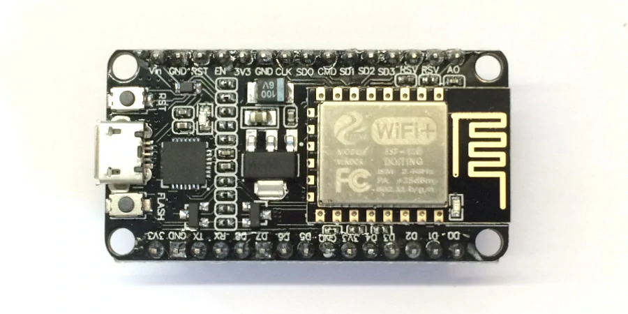
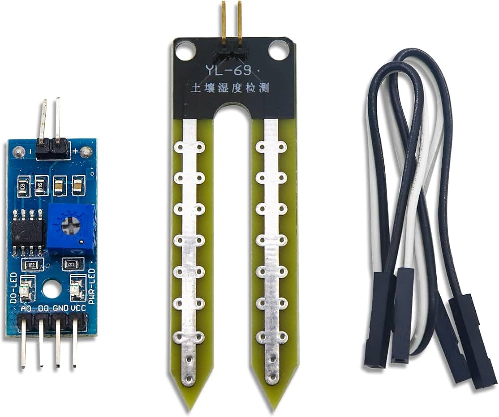
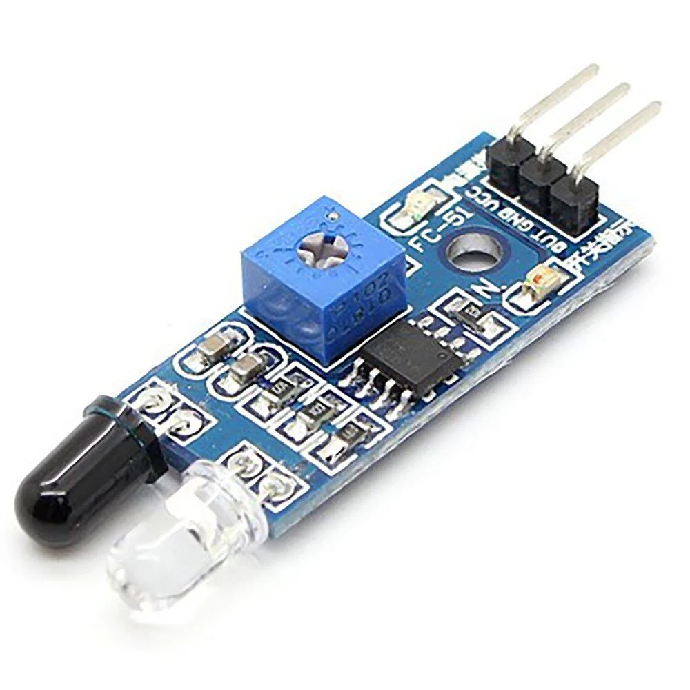
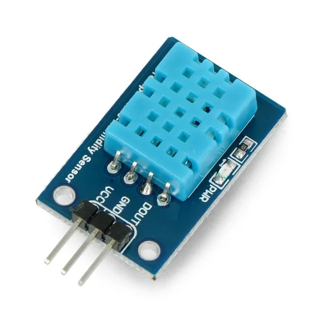
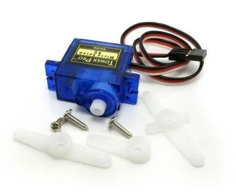
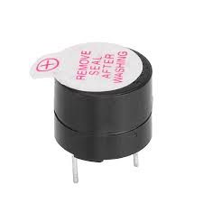
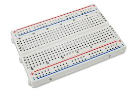
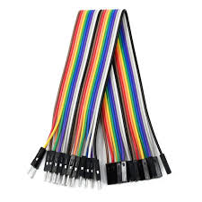
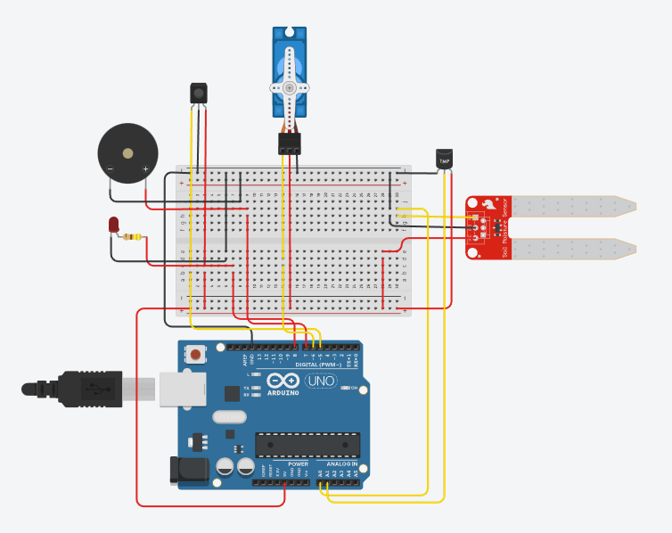

# 🌱 SPROUT — Smart Plant Monitoring & Protection System

SPROUT is a small IoT-based system designed to monitor plant conditions and provide basic protection against external disturbances using sensors, local decision logic, and a microcontroller.

The project focuses on building a simple, reliable system that reacts to real-world conditions rather than theoretical scenarios.

## Motivation

The motivation for building SPROUT came from observing a recurring real-world problem.

Plants in open or semi-open environments are often damaged by small animals such as monkeys or squirrels. These animals disturb the soil, damage roots, or break stems—usually when no one is around to notice it in time.

SPROUT was built to act as a simple monitoring and protection layer. Instead of relying on constant human supervision, the system observes key conditions around a plant and responds locally when unusual activity is detected.

The aim was not to eliminate the problem completely, but to reduce unnoticed damage through timely awareness and basic deterrence.

## What the System Does

SPROUT operates as a small, self-contained monitoring system placed near a plant.

At a high level, the system:
- monitors soil moisture to indicate plant water condition
- observes temperature to understand the surrounding environment
- detects motion near the plant area
- reacts locally when predefined conditions are met

When soil moisture drops below a set threshold, the system provides a visual indication.  
When motion is detected near the plant, the system triggers a basic protective response.

In addition to local responses, the system is designed to send sensor data to a cloud platform (ThingSpeak) for remote monitoring.  
This data can be viewed through dashboards or a simple Android application, allowing plant conditions to be observed without being physically present.

Local decision-making ensures the system remains responsive, while cloud integration enables observation and future expansion.

All decisions are made locally on the device, keeping the system simple, responsive, and independent of constant network availability.

## System Workflow

SPROUT follows a simple and repeatable workflow designed for reliability.

1. The system continuously reads data from the connected sensors, including soil moisture, temperature, and motion.
2. Sensor values are processed locally and compared against predefined thresholds.
3. If soil moisture falls below the threshold, the system provides a visual alert to indicate that attention is required.
4. If motion is detected near the plant, the system triggers a basic protective response using actuators.
5. Sensor readings are periodically sent to the cloud platform for remote observation and record keeping.

This workflow allows the system to react immediately to local conditions while also supporting remote monitoring and future analysis.

## Hardware Components

SPROUT is built using commonly available, low-cost components to keep the system accessible and easy to replicate.

### Controller
- Arduino Uno (used for simulation and wiring validation)
- NodeMCU ESP8266 (intended deployment hardware)

### Sensors
- Soil Moisture Sensor (analog)
- Temperature Sensor (TMP36 used in simulation)
- IR Motion Sensor

### Actuators & Indicators
- Servo Motor (used for physical response)
- Buzzer (audio alert)
- LED with resistor (visual indication)

### Supporting Components
- Breadboard
- Jumper wires
- USB power source

## Hardware Components (Visual Reference)

Below are the actual components used in the SPROUT system.  
They are grouped by role to keep the section readable and visually balanced.

---

### Controller

| Component | Preview |
|---------|--------|
| NodeMCU ESP8266 |  |

---

### Sensors

| Component | Preview |
|---------|--------|
| Soil Moisture Sensor |  |
| IR Motion Sensor |  |
| DHT11 Sensor |  |

---

### Actuators & Indicators

| Component | Preview |
|---------|--------|
| Servo Motor |  |
| Buzzer |  |
| LED |  |
| Resistor (220Ω) | .jpg) |

---

### Supporting Components

| Component | Preview |
|---------|--------|
| Breadboard |  |
| Jumper Wires |  |
| USB Cable |  |

## Wiring Diagram & Simulation Notes

The wiring diagram below represents the validated hardware connections used during simulation.

### Important Notes

- The wiring diagram was created and tested using **Arduino Uno in Tinkercad** for ease of simulation and validation.
- The **actual hardware implementation uses NodeMCU ESP8266**.
- Pin numbers differ between Arduino Uno and NodeMCU, but the **logical connections remain the same**.
- This approach allows reliable testing in simulation while keeping the final deployment flexible.

The diagram focuses on clarity and correctness rather than physical enclosure or layout aesthetics.

## Firmware Structure & Behavior

The firmware is responsible for reading sensor data, applying simple decision logic, and controlling actuators based on real-world conditions.

### Core Responsibilities

- Read soil moisture, temperature, and motion sensor values
- Compare sensor readings against predefined thresholds
- Trigger local responses such as LED indication, buzzer alert, and servo movement
- Send sensor data to the cloud platform for remote monitoring

### Design Approach

The firmware is intentionally kept:
- modular and readable
- focused on reliability over complexity
- easy to extend with additional features

Local decision-making ensures immediate response even if network connectivity is unavailable, while cloud integration enables observation and future analysis.

### Firmware Location

The repository contains the **current stable version** of the firmware.  
Earlier experimental iterations are intentionally excluded to keep the codebase clean and understandable.

## Cloud & Android App Integration

SPROUT supports remote monitoring through cloud connectivity using **ThingSpeak**.

Sensor data from the system is uploaded to ThingSpeak, where it is stored and visualized through dashboards. This allows plant conditions to be observed remotely without being physically present near the setup.

To make monitoring more accessible on mobile devices, the data can also be viewed using the **ThinkView Android application**, which reads data directly from ThingSpeak channels and displays it in a user-friendly format.

The system is designed so that cloud connectivity enhances observation but does not control core behavior. Local monitoring and responses continue to function independently.

---

### Using ThingSpeak with SPROUT (High-Level Steps)

1. Create a ThingSpeak account at https://thingspeak.com  
2. Create a new channel and enable the required fields (soil moisture, temperature, motion, etc.)
3. Copy the **Write API Key** generated for the channel
4. Add the API key to the firmware before uploading it to the device
5. Upload the firmware and power the system
6. Observe live data updates on the ThingSpeak dashboard

---

### Viewing Data on Android (ThinkView App)

1. Install **ThinkView** from the Google Play Store
2. Open the app and choose ThingSpeak as the data source
3. Enter the Channel ID and Read API Key
4. Select the fields to display
5. Monitor sensor values directly from the Android device

## Deployed Setup — SPROUT in Use

  

  <em>SPROUT deployed near a plant in its intended real-world environment</em>

This setup shows how the system is positioned close to the plant to monitor conditions and respond to disturbances.  
The focus is on practical placement and functionality rather than a lab-style arrangement.

